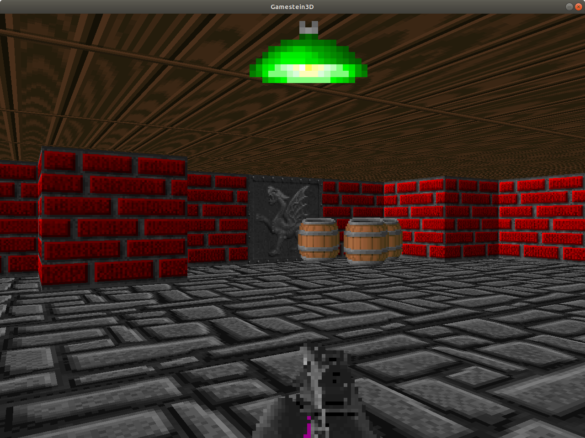
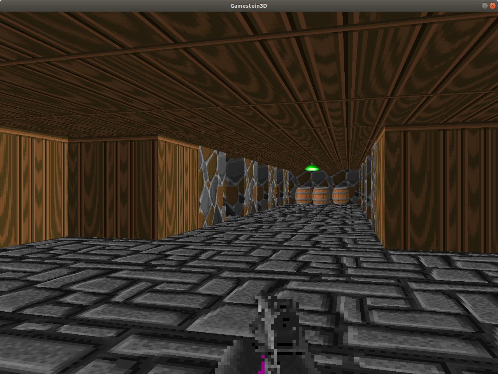

# Gamestein3D

## About

Gamestein3D is a very basic 3D engine based upon 'retro' ray-casting techniques as used in the famous ID Software Wolfenstein 3D.

It's first design goal was to build a java implementation of the CG Raycasting tutorials as described on 'Lode's Computer Graphics Tutorial' https://lodev.org/cgtutor/raycasting.html and a similar tutorial on instructables 'Making-a-Basic-3D-Engine-in-Java' https://www.instructables.com/id/Making-a-Basic-3D-Engine-in-Java/.

So the engine has 3D walls, floor and ceiling rendering as well as 2D sprite assets rendering.

I've added gamepad support and basic sound playing capabilities.

It think it's a nice starting point for STEM teachers or students to learn some game engine techniques, math's or simply use it to create a custom level by changing some data in the code.

This version will be branched in the 'edu' branch.

My second goal is to have a complete game engine that can load game worlds so that youngsters (my son) can create their own gameworlds, with assets, npc's, trading system, dialogs, etc... and maybe a networked version if a pandemic strikes again.

This will occur in the master branch.

And yes this project (edu branch) was created in a weekend (May 1 weekend 2020) some sort of bet with my son ;-)

## Screen shots

## Usage

Use your favorite java IDE: eclipse, intelliJ, netbeans.

Clone the project from git, configure it as a maven project.

Currently only depends on the Jamepad library for gamepad support.

Run it: main class -> be.makercafe.gamestein3d.Game

## License

Copyright (C) 2020  Luc De pauw

    This program is free software: you can redistribute it and/or modify
    it under the terms of the GNU General Public License as published by
    the Free Software Foundation, either version 3 of the License, or
    (at your option) any later version.

    This program is distributed in the hope that it will be useful,
    but WITHOUT ANY WARRANTY; without even the implied warranty of
    MERCHANTABILITY or FITNESS FOR A PARTICULAR PURPOSE.  See the
    GNU General Public License for more details.

    You should have received a copy of the GNU General Public License
    along with this program.  If not, see <https://www.gnu.org/licenses/>

* Notice some textures are taken from the ID software shareware Wolfenstein and are copyright ID software. They are only included for educational purpose not for redistribution in any form.

## Raycasting 

* If you are curious how raycasting works, Lode did a very good job explaining his on his website https://lodev.org/cgtutor/raycasting.html

## Credits

* Luc De pauw well for creating the Gamestein3D engine.
* Quince De pauw for battle testing the engine.

* External resources
	* Lode vandenvenne for the CG tutorials.
	* Williama Hartman for the gamepad library Jamepad
	* Finn Kuusisto for the TinySound library.
	* ID software for creating a new game genre.
 

## Links

* https://lodev.org/cgtutor/raycasting.html
* https://www.instructables.com/id/Making-a-Basic-3D-Engine-in-Java/
* https://permadi.com/1996/05/ray-casting-tutorial-table-of-contents/
* http://www.wolfenstein3d.co.uk/
  * AlumiuN mp gun from textureAI.zip
  * Walld from texturepack wh64x64.zip
* http://soundbible.com/2020-Normal-Shotgun.html	
* https://github.com/williamahartman/Jamepad
* https://github.com/finnkuusisto/TinySound
* https://nl.wikipedia.org/wiki/Id_Software

